# Integrated Academic Insights Portal (IAIP)

The Integrated Academic Insights Portal (IAIP) is a full–stack academic management and analytics system developed as a DBMS project. It provides an end-to-end solution for managing academic data such as students, faculty, departments, courses, attendance, assessments, final results, and semester-wise GPA.

The system is built using:
- MySQL (15-table normalized schema)
- Flask (REST API backend)
- React + TypeScript (Vite frontend)

IAIP replaces manual Excel-based processes with a structured, scalable, and data-driven digital portal.

---

## Overview

IAIP centralizes all core academic workflows into one unified platform. It manages:

- Student and faculty information  
- Department and course structures  
- Semester-wise course offerings  
- Student enrollments  
- Subject-wise attendance tracking  
- Internal and external assessments  
- Final results and grade computation  
- GPA analytics and performance trends  

The platform follows a clean three-tier architecture with separation between frontend, backend, and database layers.

---

## Features

### Academic Management
- Student information management  
- Faculty information management  
- Departments and course catalog  
- Semester-wise course offerings  
- Student course enrollments  

### Academic Insights
- Subject-wise attendance tracking  
- Internal and external assessment components  
- Computation of final marks and grades  
- GPA calculation per semester  
- Performance analytics and report views  

### Role-Based Access
- Admin  
- Faculty  
- Student  

### Tech Stack
Frontend: React, TypeScript, Vite  
Backend: Python (Flask)  
Database: MySQL (XAMPP)  
Tools: mysql-connector-python, Node.js, npm  

---

## System Architecture
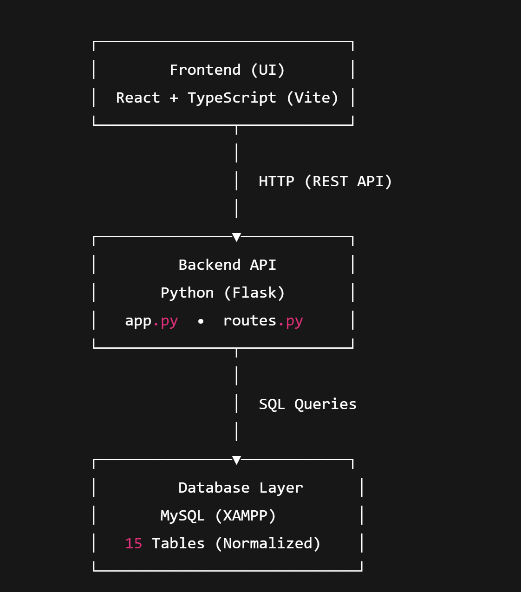

## Installation and Setup

### Backend Setup (Flask + MySQL)

Start MySQL (XAMPP).

Create the database:

CREATE DATABASE academic_portal;

Import the schema using phpMyAdmin (schema.sql).

### Install Python dependencies:

pip install -r requirements.txt

Run the backend server:

python app.py

The backend will run at:

http://127.0.0.1:5000/

### Frontend Setup (React + Vite)

Install dependencies:

npm install

Run the development server:

npm run dev

Open the application in a browser (usually):

http://localhost:5173/

### API Endpoints
#### GET Endpoints
- /students     → Fetch list of all students  
- /faculty      → Fetch list of all faculty  

#### POST Endpoints
- /add_student  → Add a new student (JSON body)

---
## Screenshots

### Login / Welcome Page

assets/ui-welcome-login.jpg

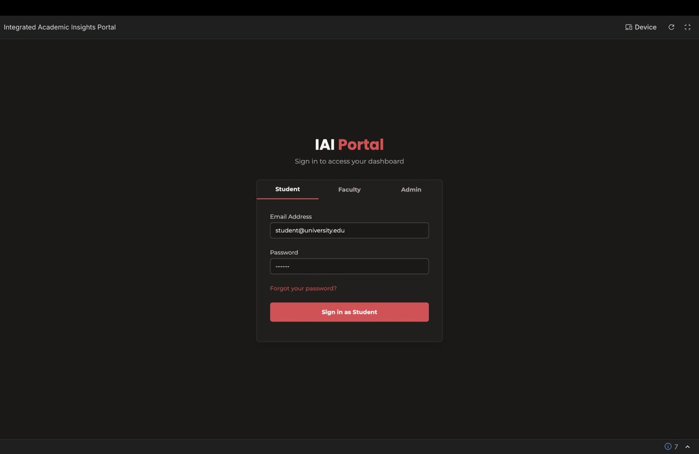

### Dashboard
assets/ui-dashboard.jpg

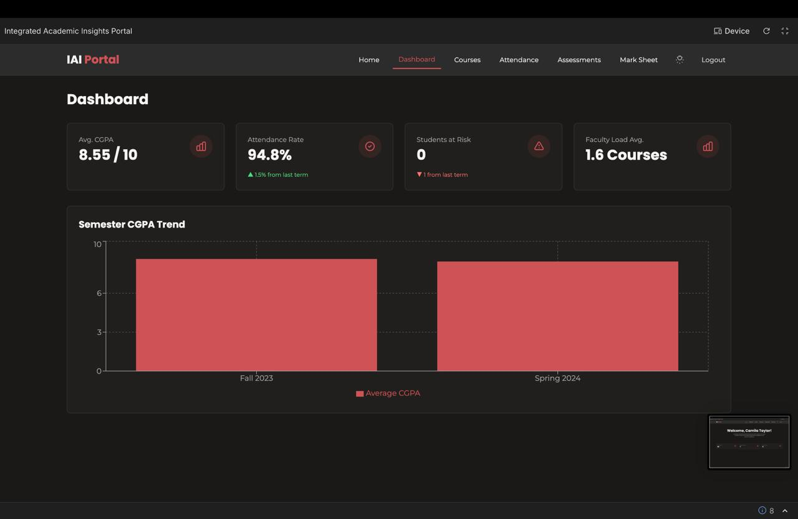

### Students Management
assets/ui-students.jpg

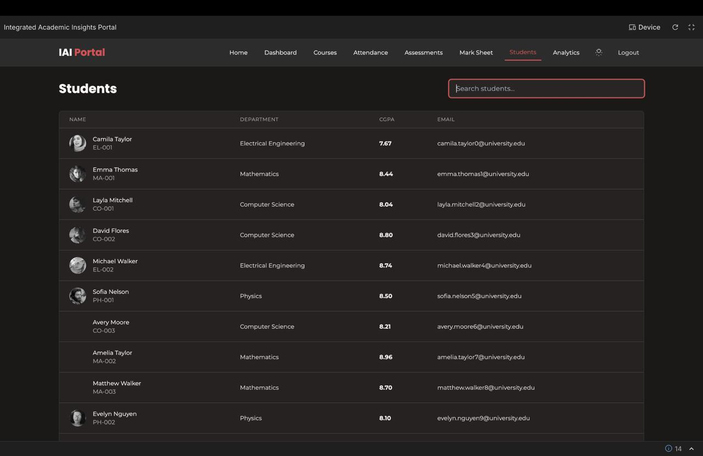

### Faculty Management
assets/ui-faculty.jpg

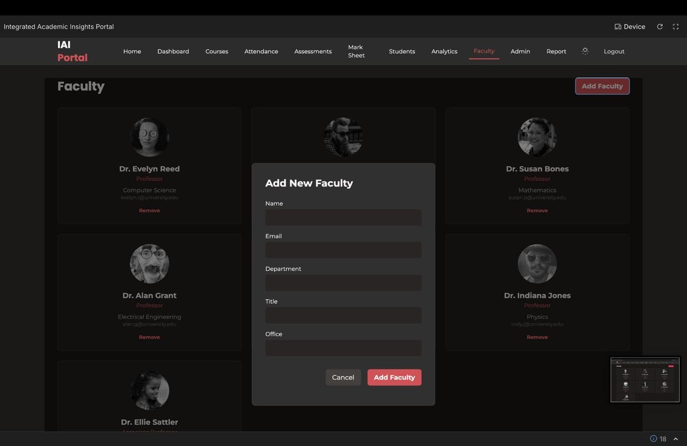

### Courses & Offerings
assets/ui-courses.jpg

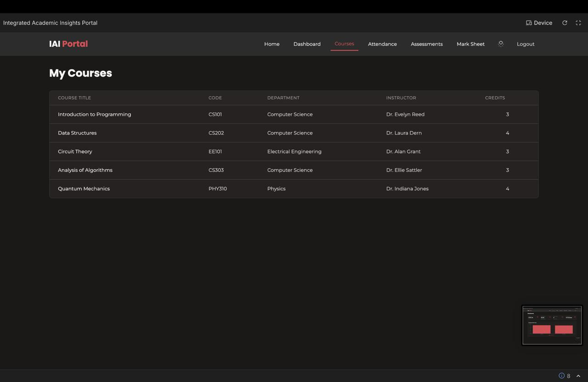

### Attendance Tracking
assets/ui-attendance.jpg

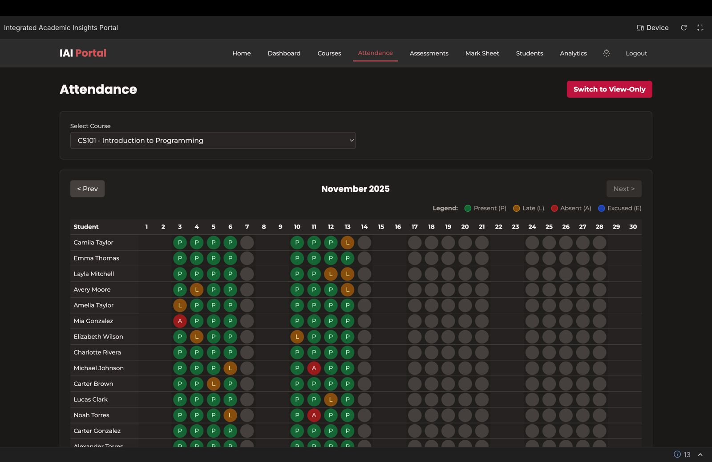

### Assessment Components
assets/ui-assessments.jpg

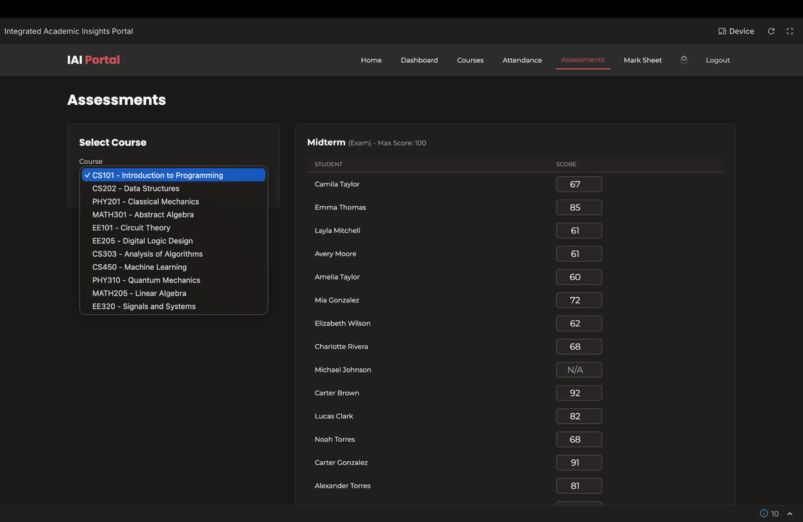

### Marksheet / GPA View
assets/ui-marksheet.jpg

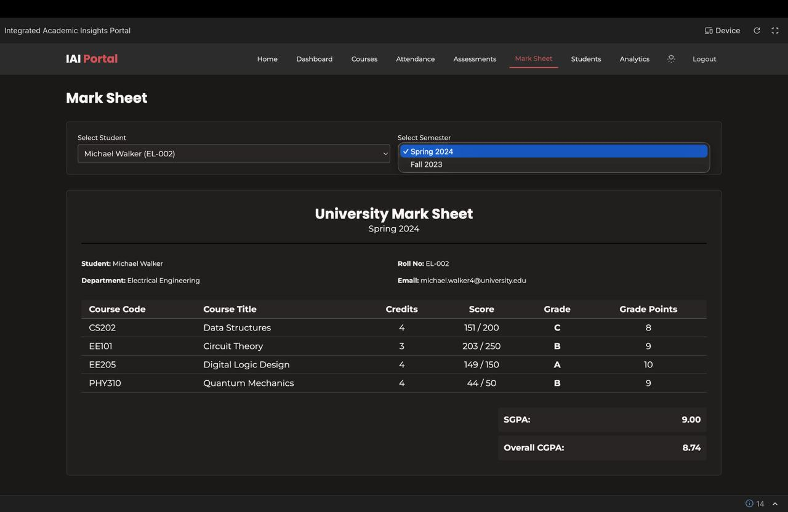

### Analytics & Reports
assets/ui-analytics.jpg

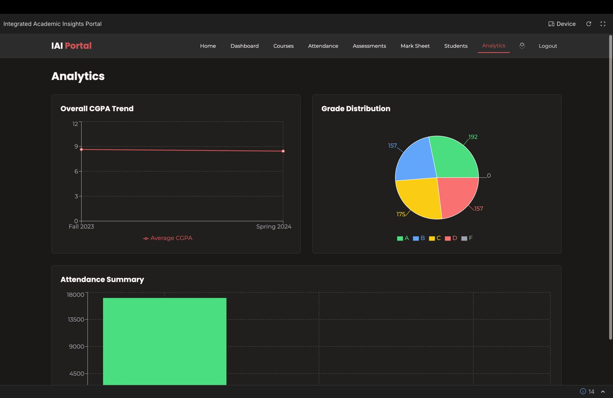

### Admin Panel
assets/ui-admin.jpg

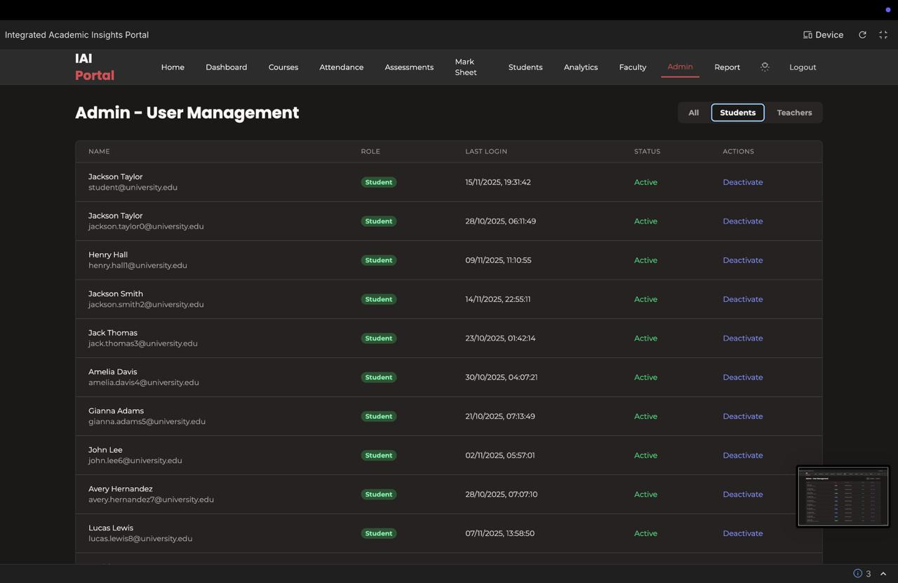

---
## Future Enhancements

Implement login authentication using the sessions table

Bulk CSV upload for student and assessment data

Export results and analytics as PDF or Excel

Notifications for low attendance or poor academic performance

Predictive analytics for academic risk assessment

---

## Author

**Name:** Your Name
**Course:** DBMS – Semester 3
**Project: **Integrated Academic Insights Portal (IAIP)
**Repository:** https://github.com/Aarush720/IAIP-DBMS-SEM3
